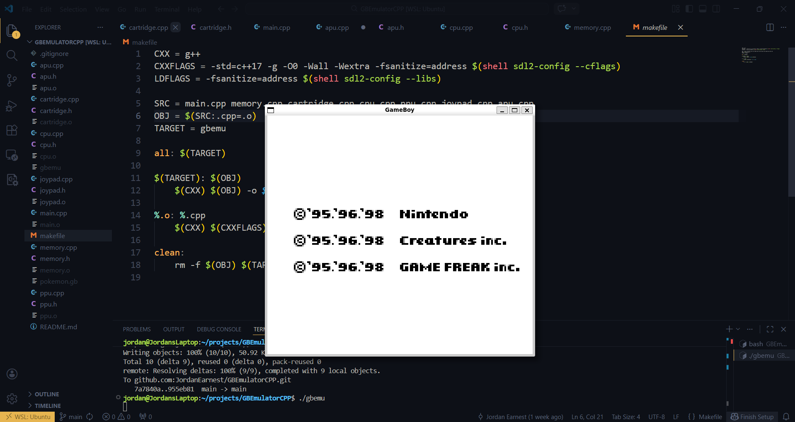
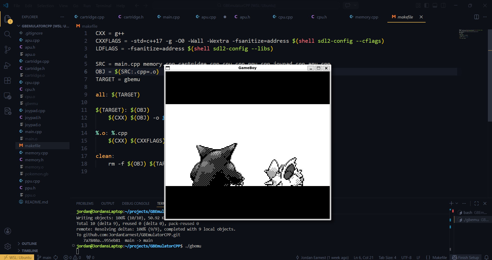
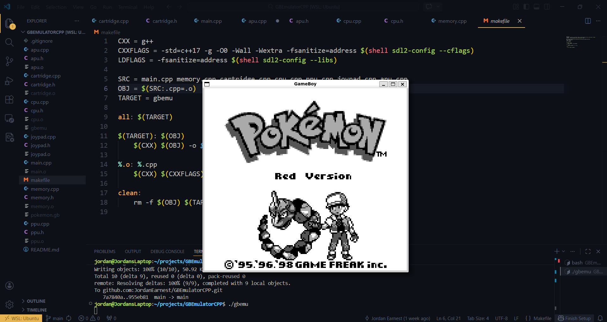
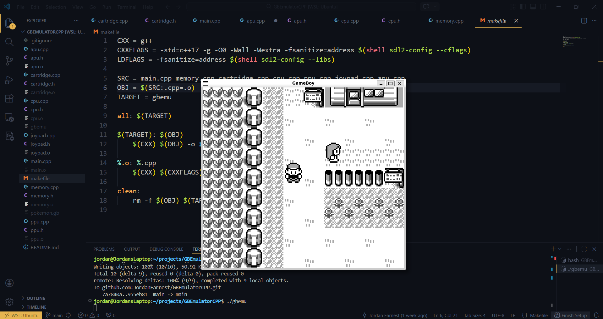
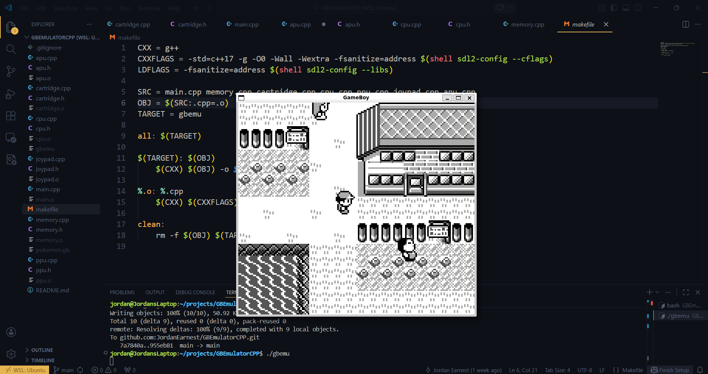
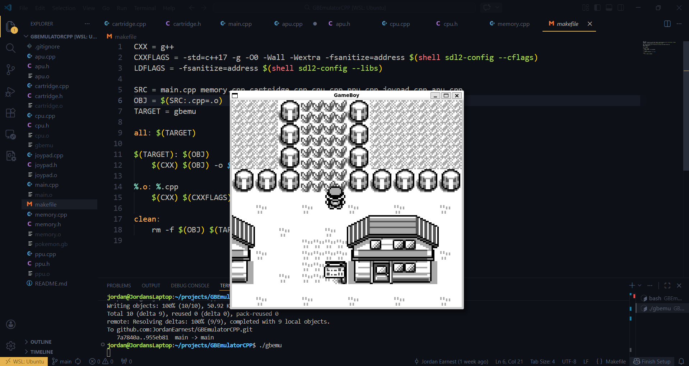

# GBEmulatorCPP
## Description
An emulator for the Game Boy written in C++ for Linux (However, you may easily compile on Windows. There are no Linux-specific parts in the code). This is not a fully functional every-day-use emulator. Instead, it was a proof-of-concept to test my understanding of lower-level hardware and learn with a fun project.<br>
Currently, only games that use the same components of the Pokemon Red cartridge works. Also, the APU is glitchy and as a result, audio is scuffed.


## Images







## How to Use
### Linux
1. If you don't have SDL2 on your Linux machine, run this first to install SDL2

```
sudo apt-get install libsdl2-dev
```

2. Clone the repository

```
git clone https://github.com/JordanEarnest/GBEmulatorCPP.git
```

3. Compile

```
make
```

4. Execute

```
./gbemu
```

## Resources
- [SM86 Instruction Set](https://gbdev.io/gb-opcodes/optables/)
- [DAA Instruction](https://blog.ollien.com/posts/gb-daa/)
- [Game Boy: Complete Technical Reference](https://gekkio.fi/files/gb-docs/gbctr.pdf)
- [The Game Boy, a hardware autopsy - Part 1: the CPU](https://www.youtube.com/watch?v=RZUDEaLa5Nw)
- [The Game Boy, a hardware autopsy - Part 2: memory mapping](https://www.youtube.com/watch?v=ecTQVa42sJc)


